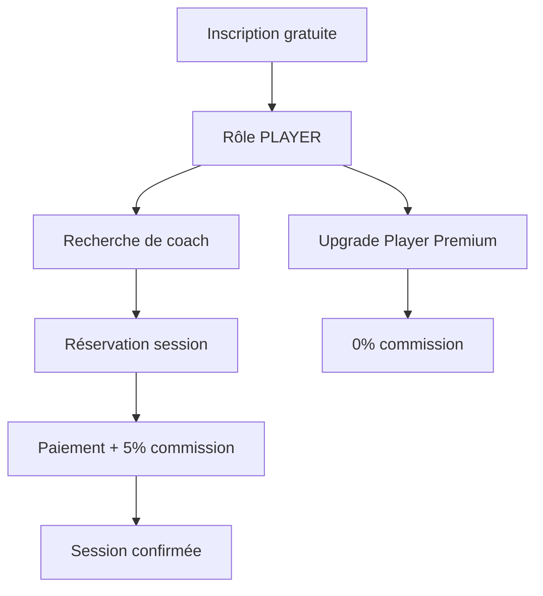
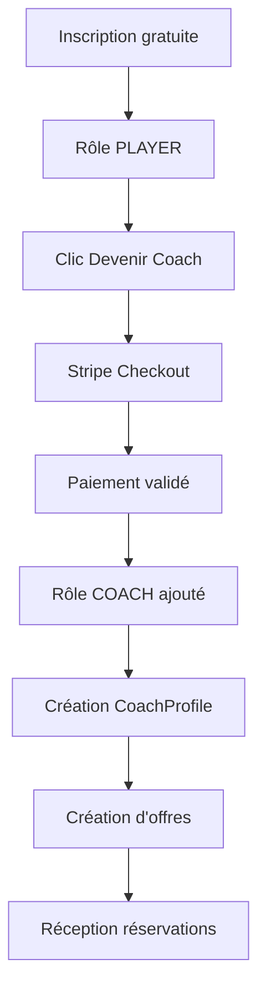

# 🎯 Logique Métier Edgemy - Plateforme de Coaching Poker

## Vue d'ensemble

Plateforme de coaching poker qui met en relation :
- **Joueurs** (users gratuits par défaut)
- **Coachs** (accès payant via abonnement Stripe)

Les deux partagent la même base `User`, avec des rôles dynamiques et des abonnements gérés via Stripe.

---

## 🧱 Architecture des données

### Modèle utilisateur

```
User (base commune)
├── roles[] (PLAYER, COACH, ADMIN)
├── subscriptions[] (abonnements Stripe)
├── coachProfile (si rôle COACH)
├── playerProfile (si rôle PLAYER)
├── coachingOffers[] (offres créées par le coach)
└── bookings[] (réservations effectuées)
```

### Types de rôles

- **PLAYER** : Rôle par défaut à l'inscription
- **COACH** : Obtenu après souscription d'un abonnement coach
- **ADMIN** : Gestion de la plateforme

### Types d'abonnements

| Plan | Description | Prix | Cible |
|------|-------------|------|-------|
| `COACH_MONTHLY` | Abonnement coach mensuel | À définir | Coachs |
| `COACH_YEARLY` | Abonnement coach annuel | À définir | Coachs |
| `PLAYER_PREMIUM` | Abonnement joueur premium (Phase 2) | À définir | Joueurs |

---

## 📋 Phase 1 (MVP) - Fonctionnalités actuelles

### 1️⃣ Inscription gratuite

**Workflow** :
1. Utilisateur s'inscrit (email/password, Google, Discord)
2. Création automatique :
   - Rôle `PLAYER` par défaut
   - `PlayerProfile` avec commission 5%
   - Aucun abonnement

**Code** :
```typescript
await prisma.user.create({
  data: {
    email,
    password,
    name,
    roles: {
      create: { type: 'PLAYER' },
    },
    playerProfile: {
      create: {
        commissionRate: 0.05, // 5% par défaut
      },
    },
  },
});
```

### 2️⃣ Devenir coach (abonnement payant)

**Workflow** :
1. Joueur clique sur "Devenir coach"
2. Redirection vers Stripe Checkout
3. Paiement validé → Webhook Stripe
4. Création automatique :
   - Rôle `COACH` ajouté
   - `CoachProfile` créé
   - `Subscription` active

**Code (webhook Stripe)** :
```typescript
await prisma.user.update({
  where: { id: userId },
  data: {
    subscriptions: {
      create: {
        plan: 'COACH_MONTHLY',
        status: 'ACTIVE',
        stripeId: subscription.id,
        startedAt: new Date(),
        expiresAt: new Date(subscription.current_period_end * 1000),
      },
    },
    roles: {
      connectOrCreate: {
        where: {
          type_userId: { type: 'COACH', userId },
        },
        create: { type: 'COACH' },
      },
    },
    coachProfile: {
      create: {},
    },
  },
});
```

### 3️⃣ Réservation de session

**Calcul des frais** :
- Prix de l'offre : `offer.price`
- Commission joueur : `5%` (tous les joueurs en Phase 1)
- Total payé par le joueur : `offer.price + (offer.price * 0.05)`

**Code** :
```typescript
const commissionRate = player.playerProfile.commissionRate; // 0.05
const commissionFee = offer.price * commissionRate;
const totalPrice = offer.price + commissionFee;

await prisma.booking.create({
  data: {
    playerId,
    coachingOfferId,
    totalPrice,
    commissionFee,
    status: 'PENDING',
  },
});
```

---

## 🚀 Phase 2 - Évolutions prévues

### 1️⃣ Abonnement Player Premium

**Avantages** :
- ✅ **0% de commission** sur les réservations
- ✅ Accès à des fonctionnalités premium
- ✅ Visibilité accrue
- ✅ Statistiques avancées

**Workflow** :
1. Joueur souscrit à "Player Premium"
2. Paiement Stripe validé
3. Mise à jour automatique :
   - `Subscription` PLAYER_PREMIUM créée
   - `commissionRate` passe à `0`

**Code (webhook Stripe)** :
```typescript
await prisma.user.update({
  where: { id: userId },
  data: {
    subscriptions: {
      create: {
        plan: 'PLAYER_PREMIUM',
        status: 'ACTIVE',
        stripeId: subscription.id,
        startedAt: new Date(),
        expiresAt: new Date(subscription.current_period_end * 1000),
      },
    },
    playerProfile: {
      update: {
        commissionRate: 0, // Plus de commission
      },
    },
  },
});
```

### 2️⃣ Calcul dynamique des frais

**Logique** :
```typescript
const isPremium = user.subscriptions.some(
  (s) => s.plan === 'PLAYER_PREMIUM' && s.status === 'ACTIVE'
);

const commissionRate = isPremium ? 0 : user.playerProfile.commissionRate;
const commissionFee = offer.price * commissionRate;
const totalPrice = offer.price + commissionFee;
```

### 3️⃣ Plans Coach avancés

**Fonctionnalités supplémentaires** :
- Analytics détaillées
- Outils de gestion de sessions
- Visibilité prioritaire
- Badge "Coach Premium"

---

## 💳 Intégration Stripe

### Webhooks à gérer

| Event | Action |
|-------|--------|
| `checkout.session.completed` | Créer subscription + rôle |
| `customer.subscription.updated` | Mettre à jour status |
| `customer.subscription.deleted` | Désactiver subscription |
| `invoice.payment_failed` | Notifier utilisateur |

### Métadonnées Stripe

Lors de la création du Checkout :
```typescript
const session = await stripe.checkout.sessions.create({
  metadata: {
    userId: user.id,
    planType: 'COACH_MONTHLY',
  },
  // ...
});
```

---

## 🔐 Gestion des rôles et permissions

### Vérification des permissions

**Middleware Next.js** :
```typescript
export async function requireCoach(userId: string) {
  const user = await prisma.user.findUnique({
    where: { id: userId },
    include: {
      roles: true,
      subscriptions: {
        where: {
          status: 'ACTIVE',
          plan: { in: ['COACH_MONTHLY', 'COACH_YEARLY'] },
        },
      },
    },
  });

  const isCoach = user?.roles.some((r) => r.type === 'COACH');
  const hasActiveSubscription = user?.subscriptions.length > 0;

  if (!isCoach || !hasActiveSubscription) {
    throw new Error('Abonnement coach requis');
  }

  return user;
}
```

### Expiration d'abonnement

**Cron job quotidien** :
```typescript
// Désactiver les abonnements expirés
await prisma.subscription.updateMany({
  where: {
    status: 'ACTIVE',
    expiresAt: { lt: new Date() },
  },
  data: {
    status: 'EXPIRED',
  },
});

// Retirer le rôle COACH si plus d'abonnement actif
const expiredCoaches = await prisma.user.findMany({
  where: {
    roles: { some: { type: 'COACH' } },
    subscriptions: {
      none: {
        status: 'ACTIVE',
        plan: { in: ['COACH_MONTHLY', 'COACH_YEARLY'] },
      },
    },
  },
});

for (const user of expiredCoaches) {
  await prisma.userRole.deleteMany({
    where: { userId: user.id, type: 'COACH' },
  });
}
```

---

## 📊 Statistiques et analytics

### Métriques clés

**Pour les coachs** :
- Nombre de sessions réalisées
- Revenus générés
- Note moyenne
- Taux de conversion

**Pour les joueurs** :
- Sessions suivies
- Montant dépensé
- Progression (à définir)

**Pour la plateforme** :
- Commissions totales
- Nombre d'utilisateurs actifs
- Taux de conversion joueur → coach
- MRR (Monthly Recurring Revenue)

---

## 🎯 Roadmap fonctionnelle

### Phase 1 (MVP) - ✅ En cours
- [x] Authentification (email, Google)
- [x] Schéma base de données
- [ ] Abonnement coach via Stripe
- [ ] Création d'offres de coaching
- [ ] Réservation de sessions
- [ ] Paiement avec commission 5%

### Phase 2 - 🔜 Prévue
- [ ] Abonnement Player Premium
- [ ] Commission dynamique (0% pour premium)
- [ ] Système de notation
- [ ] Chat en temps réel
- [ ] Calendrier intégré
- [ ] Analytics avancées

### Phase 3 - 💡 Future
- [ ] Marketplace d'offres
- [ ] Système de parrainage
- [ ] Programme d'affiliation
- [ ] API publique
- [ ] Application mobile

---

## 🔄 Flux utilisateur complets

### Parcours joueur



### Parcours coach



---

## 📝 Notes techniques

### Contraintes importantes

1. **Un user peut avoir plusieurs rôles** (PLAYER + COACH)
2. **Un user peut avoir plusieurs subscriptions** (historique)
3. **Seules les subscriptions ACTIVE comptent** pour les permissions
4. **La commission est calculée côté serveur** (sécurité)
5. **Les webhooks Stripe doivent être idempotents** (éviter doublons)

### Sécurité

- ✅ Validation Zod sur tous les inputs
- ✅ Vérification des rôles côté serveur
- ✅ Signature des webhooks Stripe
- ✅ Rate limiting sur les API
- ✅ CSRF protection
- ✅ Sanitization des données utilisateur

---

## 🆘 Support et documentation

- **Schéma Prisma** : `prisma/schema.prisma`
- **Variables d'env** : `ENV_VARIABLES.md`
- **Setup Google OAuth** : `GOOGLE_OAUTH_SETUP.md`
- **Setup Better Auth** : `BETTER_AUTH_SETUP.md`

---

**Dernière mise à jour** : 2025-10-09
