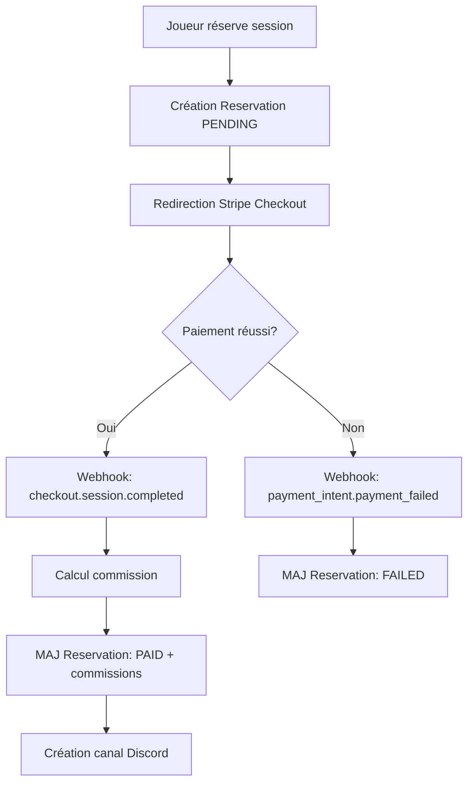
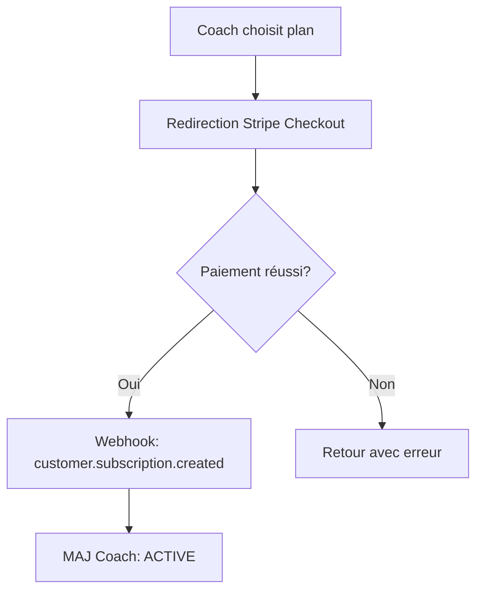

# 🎯 Intégration Stripe Phase 1 - Edgemy

## 📋 Vue d'ensemble

L'intégration Stripe Phase 1 comprend :
- ✅ Paiements des sessions de coaching (singles et packs)
- ✅ Calcul automatique des commissions
- ✅ Abonnements coach (mensuel/annuel)
- ✅ Webhooks pour confirmations de paiement
- ✅ Tracking des commissions

## 💰 Règles de Commission Phase 1

### Sessions Uniques (SINGLE)
- **Commission Edgemy** : +5% du prix de la session
- **Coach reçoit** : 100% du montant payé par le joueur
- **Total perçu par Edgemy** : 5% du montant

**Exemple** :
- Joueur paie : 50€
- Commission Edgemy : 2,50€ (5%)
- Coach reçoit : 50€

### Packs d'heures (PACK)
- **Commission Edgemy** : 3€ fixe + 2% du prix du pack
- **Coach reçoit** : 100% du montant payé par le joueur
- **Total perçu par Edgemy** : 3€ + 2%

**Exemple** :
- Joueur paie : 200€
- Commission Edgemy : 3€ + 4€ (2%) = 7€
- Coach reçoit : 200€

## 🏗️ Architecture

### Modèles Prisma

#### Reservation (Mise à jour)
```prisma
model Reservation {
  // ... champs existants
  type               ReservationType   @default(SINGLE)
  priceCents         Int
  commissionCents    Int               @default(0)
  coachEarningsCents Int               @default(0)
  stripePaymentId    String?
}
```

#### Coach (Mise à jour)
```prisma
model coach {
  // ... champs existants
  stripeCustomerId       String?
  subscriptionId         String?
  subscriptionStatus     SubscriptionStatus?
  subscriptionPlan       SubscriptionPlan?
  currentPeriodEnd       DateTime?
}
```

### API Routes

| Route | Méthode | Description |
|-------|---------|-------------|
| `/api/stripe/create-session` | POST | Créer session de paiement Stripe |
| `/api/stripe/webhook` | POST | Recevoir événements Stripe |
| `/api/stripe/subscribe-coach` | POST | Créer abonnement coach |
| `/api/stripe/subscribe-coach` | DELETE | Annuler abonnement coach |

## 🔧 Configuration

### 1. Variables d'environnement

Ajoutez dans votre `.env` :

```bash
# Stripe
STRIPE_SECRET_KEY=sk_test_...
NEXT_PUBLIC_STRIPE_PUBLISHABLE_KEY=pk_test_...
STRIPE_WEBHOOK_SECRET=whsec_...

# Price IDs des abonnements coach (à créer dans Stripe Dashboard)
STRIPE_COACH_MONTHLY_PRICE_ID=price_...  # 39€/mois
STRIPE_COACH_YEARLY_PRICE_ID=price_...   # 399€/an

# URL de l'app
NEXT_PUBLIC_APP_URL=http://localhost:3000
```

### 2. Créer les produits d'abonnement dans Stripe

1. Allez dans **Stripe Dashboard → Products**
2. Créez deux produits :

**Abonnement Coach Mensuel**
- Nom : `Abonnement Coach - Mensuel`
- Prix : 39€/mois récurrent
- Copiez le **Price ID** → `STRIPE_COACH_MONTHLY_PRICE_ID`

**Abonnement Coach Annuel**
- Nom : `Abonnement Coach - Annuel`
- Prix : 399€/an récurrent
- Copiez le **Price ID** → `STRIPE_COACH_YEARLY_PRICE_ID`

### 3. Configurer les webhooks Stripe

Événements à écouter :

#### Paiements de sessions
- ✅ `checkout.session.completed`
- ✅ `payment_intent.succeeded`
- ✅ `payment_intent.payment_failed`

#### Abonnements coach
- ✅ `customer.subscription.created`
- ✅ `customer.subscription.updated`
- ✅ `customer.subscription.deleted`
- ✅ `invoice.payment_failed`
- ✅ `invoice.payment_succeeded`

**URL du webhook** : `https://votre-domaine.com/api/stripe/webhook`

## 📊 Flux de paiement

### Session de coaching



### Abonnement coach



## 🎨 Intégration Frontend

### Payer une session (Joueur)

```tsx
import { redirectToCheckout } from '@/lib/stripe-client';

// Dans votre composant de réservation
const handlePayment = async () => {
  await redirectToCheckout({
    reservationId: reservation.id,
    coachName: 'John Doe',
    playerEmail: player.email,
    price: 50, // en euros
    type: 'SINGLE', // ou 'PACK'
  });
};
```

### S'abonner (Coach)

```tsx
import { redirectToCoachSubscription, cancelCoachSubscription } from '@/lib/stripe-client';

// S'abonner
const handleSubscribe = async (plan: 'MONTHLY' | 'YEARLY') => {
  await redirectToCoachSubscription(plan);
};

// Annuler
const handleCancel = async () => {
  const result = await cancelCoachSubscription();
  alert(`Abonnement annulé. Actif jusqu'au ${result.currentPeriodEnd}`);
};
```

## 🧪 Tests

### Tester un paiement de session

1. Réservez une session depuis l'interface
2. Utilisez la carte de test : `4242 4242 4242 4242`
3. Vérifiez dans les logs :
   ```
   ✅ Checkout session complétée pour la réservation xxx (SINGLE)
   💰 Calcul commission:
     - Joueur paie: 50€
     - Commission Edgemy: 2.5€
     - Coach reçoit: 50€
   ✅ Réservation xxx marquée comme PAID et CONFIRMED
   ```
4. Vérifiez la base de données :
   - `paymentStatus` = `PAID`
   - `status` = `CONFIRMED`
   - `commissionCents` = 250
   - `coachEarningsCents` = 5000

### Tester un abonnement coach

1. Allez dans les paramètres coach
2. Choisissez un plan (mensuel/annuel)
3. Utilisez la carte de test : `4242 4242 4242 4242`
4. Vérifiez dans les logs :
   ```
   ✅ Abonnement coach mis à jour: xxx - ACTIVE (MONTHLY)
   ```
5. Vérifiez la base de données :
   - `subscriptionStatus` = `ACTIVE`
   - `subscriptionPlan` = `MONTHLY`
   - `currentPeriodEnd` = date future

## 📈 Tracking des commissions

### Requête SQL pour voir les commissions

```sql
-- Total des commissions par coach
SELECT
  c.id,
  u.name as coach_name,
  COUNT(r.id) as total_sessions,
  SUM(r."priceCents") / 100 as total_revenue_euros,
  SUM(r."commissionCents") / 100 as total_commission_euros,
  SUM(r."coachEarningsCents") / 100 as total_coach_earnings_euros
FROM coach c
JOIN "user" u ON c."userId" = u.id
JOIN "Reservation" r ON r."coachId" = c.id
WHERE r."paymentStatus" = 'PAID'
GROUP BY c.id, u.name
ORDER BY total_commission_euros DESC;
```

### API pour récupérer les stats

```typescript
// TODO: Créer /api/admin/commissions
export async function GET(req: Request) {
  const commissions = await prisma.reservation.groupBy({
    by: ['coachId'],
    where: { paymentStatus: 'PAID' },
    _sum: {
      priceCents: true,
      commissionCents: true,
      coachEarningsCents: true,
    },
    _count: true,
  });

  return NextResponse.json(commissions);
}
```

## 🔒 Sécurité

### Points de vigilance

1. ✅ **Validation webhook** : Signature Stripe toujours vérifiée
2. ✅ **Calcul côté serveur** : Commissions calculées uniquement backend
3. ✅ **Authentification** : Toutes les routes protégées
4. ✅ **Montants en centimes** : Évite les erreurs d'arrondi

### Vérifications

- [ ] Les clés Stripe ne sont pas commitées
- [ ] `STRIPE_WEBHOOK_SECRET` est bien défini
- [ ] Les webhooks sont bien reçus (vérifier les logs)
- [ ] Les commissions sont correctement calculées
- [ ] Les canaux Discord sont créés après paiement

## 🚀 Déploiement Production

### Checklist

1. **Stripe Dashboard**
   - [ ] Passer en mode Live (désactiver le mode Test)
   - [ ] Créer les produits d'abonnement en Live
   - [ ] Configurer le webhook en Live avec l'URL de production
   - [ ] Copier les clés Live dans les variables d'environnement

2. **Variables d'environnement**
   - [ ] `STRIPE_SECRET_KEY` → Clé Live (commence par `sk_live_`)
   - [ ] `NEXT_PUBLIC_STRIPE_PUBLISHABLE_KEY` → Clé Live (commence par `pk_live_`)
   - [ ] `STRIPE_WEBHOOK_SECRET` → Secret du webhook Live
   - [ ] `STRIPE_COACH_MONTHLY_PRICE_ID` → Price ID Live
   - [ ] `STRIPE_COACH_YEARLY_PRICE_ID` → Price ID Live
   - [ ] `NEXT_PUBLIC_APP_URL` → URL de production

3. **Tests en production**
   - [ ] Tester un paiement de session avec une vraie carte (petit montant)
   - [ ] Vérifier que le webhook est bien reçu
   - [ ] Vérifier les commissions dans la base de données
   - [ ] Tester un abonnement coach
   - [ ] Tester l'annulation d'un abonnement

## 📞 Support

### Problèmes courants

**Les webhooks ne sont pas reçus**
- Vérifiez que `STRIPE_WEBHOOK_SECRET` est correct
- Vérifiez l'URL du webhook dans Stripe Dashboard
- Consultez les logs dans Stripe Dashboard → Developers → Webhooks

**Les commissions sont incorrectes**
- Vérifiez le type de réservation (`SINGLE` ou `PACK`)
- Consultez les logs du webhook pour voir le calcul
- Vérifiez la fonction `calculateCommission()` dans `src/lib/stripe/commission.ts`

**L'abonnement ne se met pas à jour**
- Vérifiez que les metadata `coachId` et `plan` sont bien présents
- Consultez les logs du webhook
- Vérifiez que le coach existe dans la base de données

## 📚 Ressources

- [Documentation Stripe](https://stripe.com/docs)
- [Stripe Testing](https://stripe.com/docs/testing)
- [Stripe Webhooks](https://stripe.com/docs/webhooks)
- [Stripe Checkout](https://stripe.com/docs/payments/checkout)
- [Stripe Subscriptions](https://stripe.com/docs/billing/subscriptions/overview)

## 🎯 Phase 2 (À venir)

Dans la Phase 2, les commissions seront supprimées et remplacées par des abonnements joueurs :
- Abonnement joueur mensuel/annuel
- Accès illimité aux sessions pour les joueurs abonnés
- Pas de commission sur les paiements
- Les coachs gardent leur abonnement

---

✅ **Intégration Stripe Phase 1 complète et prête à déployer !**
